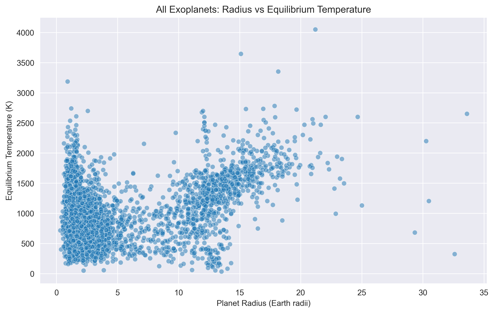

# Exoplanet Habitability Analysis

## Introduction
In recent years, **thousands of exoplanets** (planets orbiting stars beyond our Sun) have been discovered through space telescopes like **Kepler**, **TESS**, and ongoing ground‑based surveys.  

One of the great scientific questions of our time is:  
> **Which of these worlds could potentially support life?**

The first step toward answering this question — and toward humanity’s long‑term goal of interstellar exploration — is to identify promising candidate worlds.  

This project applies **Exploratory Data Analysis (EDA)** to the [NASA Exoplanet Archive](https://exoplanetarchive.ipac.caltech.edu/cgi-bin/TblView/nph-tblView?app=ExoTbls&config=PSCompPars), filtering planets based on scientifically motivated criteria to highlight the ones most similar to Earth.

---

## Dataset
Data source: **NASA Exoplanet Archive (Planetary Systems Composite Parameters)**  
Link: https://exoplanetarchive.ipac.caltech.edu/cgi-bin/TblView/nph-tblView?app=ExoTbls&config=PSCompPars
- Retrieved: August 2025  
- Contains confirmed exoplanets and their physical and orbital parameters.

### Scatter Plot (All planets)


---

## Project Goals
- Perform exploratory analysis of exoplanet properties.  
- Apply habitability filters:
  - Equilibrium Temperature & Planet Radius  
  - Planet Mass  
  - Stellar Spectral Type  
  - Distance from Earth  
- Compute an **Earth Similarity Score** (a Gaussian‑like decay function weighting temperature and gravity).  
- Visualize the filtering process and highlight candidate habitable planets.  
- Compare the final selection to Earth via **summary tables and radar charts**.  

---

## Why It Matters
- Identifying nearby Earth‑like planets is crucial for understanding our place in the universe.  
- Data science and astronomy intersect here: filtering raw astrophysical data into **meaningful, interpretable insights**.  
- This project demonstrates:  
  - Robust **EDA techniques**  
  - **Data‑driven scientific reasoning**  
  - Clear **visual communication of results**

---

## Final Results & Conclusions
After applying the habitability filters, the analysis identifies **6 nearby candidate planets within ~20 light years**:

### Radar Chart (Earth vs Candidates)


| Planet             | Distance (ly) | Habitability Score | Gravity (× Earth) | Est. Temp (°C) |
|--------------------|---------------|-------------------|-------------------|----------------|
| Proxima Cen b      | 4.2           | 0.740             | 1.01              | –55            |
| Ross 128 b         | 11.0          | 0.860             | 1.14              | +28            |
| Teegarden’s Star b | 12.5          | 0.918             | 1.05              | +4             |
| Teegarden’s Star c | 12.5          | 0.719             | 1.01              | –64            |
| GJ 1002 b          | 15.8          | 0.775             | 1.02              | –42            |
| GJ 1002 c          | 15.8          | 0.584             | 1.12              | –91            |

### Key Insights
- **Temperature & Surface Gravity**: Temperature weighs more strongly (65%) in determining habitability, while gravity affects atmosphere retention.  
- **Proximity vs. Habitability**:
  - *Proxima Centauri b* is the nearest (4.2 ly) but faces colder temperatures.  
  - *Teegarden’s Star b* scores highest in similarity but lies further away (12.5 ly).  
- **Gravity Close to Earth**: All candidates would allow humans to stand and move normally (1.01–1.14 × Earth gravity).  
- **Temperature Range**: Candidates range from –91 °C to +28 °C, spanning potentially freezing to Earth‑like climates.  

---

## Limitations & Next Steps
- **Equilibrium Temperature** ignores greenhouse effects and actual atmospheric conditions.  
- **Mass and radius** lead to rough surface composition estimates; internal dynamics remain unknown.  
- Critical factors not included: **magnetic fields, atmospheres, and tectonics**.  
- Future improvements:
  - Integrate atmospheric/spectral data for refined predictions.  
  - Use machine learning or statistical models for habitability ranking.  

---

## Repository Structure
```text
├── notebooks/  # Jupyter notebooks with full analysis
├── figures/  # Exported plots and visualizations
├── data/  # Dataset
├── requirements.txt  # Python dependencies
├── README.md  # Project documentation
└── LICENSE  # MIT License
```

---

## License
This project is licensed under the MIT License – see the LICENSE file for details.
